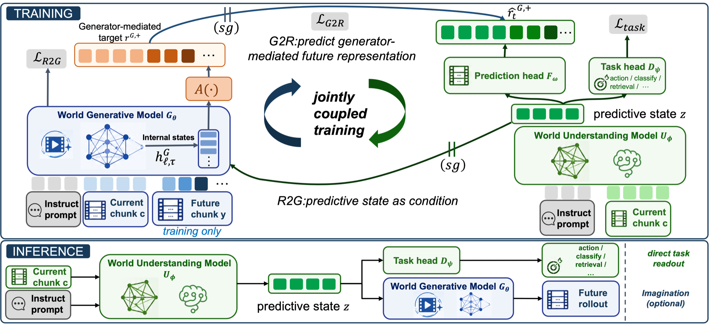

# Enfold

Official codebase for **Enfold: Folding World-Generator Computation into Predictive Representations for Efficient Embodied Control**

<p align="center">
  
</p>

<p align="center">
  <a href="./README.md"></a>
  <a href="./README_zh.md"></a>
  <a href="https://arxiv.org/abs/2607.26657"></a>
  <a href="https://zwl666666.github.io/enfold/"></a>
  <a href="https://huggingface.co/richardxyt/Enfold"></a>
</p>

## Results

### LIBERO

| Method | P.T. | Model Size | Latency (ms) | Long | Goal | Object | Spatial | Average |
| --- | :---: | ---: | ---: | ---: | ---: | ---: | ---: | ---: |
| OpenVLA-OFT | ✓ | 7B | - | 94.5 | 97.9 | 98.4 | 97.6 | 97.1 |
| π0 | ✓ | 3.5B | 184 | 88.4 | 94.4 | 96.8 | 98.0 | 94.4 |
| π0.5 | ✓ | 3.5B | 184 | 92.4 | <u>98.0</u> | 98.2 | **98.8** | 96.9 |
| GR00T-N1.6 | ✓ | 3.3B | 232 | 94.4 | 97.5 | 98.5 | 97.7 | 97.0 |
| LAPA | ✓ | 7B | - | 55.4 | 58.8 | 74.6 | 73.8 | 65.7 |
| UniVLA | ✓ | 7B | - | 92.0 | 95.6 | 96.8 | 96.5 | 95.2 |
| Mantis | ✓ | 5.8B | - | 94.2 | 94.4 | 99.2 | **98.8** | 96.7 |
| VLA-JEPA | ✗ | 3B | - | 95.8 | 97.2 | 99.6 | 96.2 | 97.2 |
| F1 | ✗ | 4B | 352 | 91.3 | 95.4 | 97.8 | 98.2 | 95.7 |
| Motus | ✗ | 8B | 2759 | <u>97.6</u> | 96.6 | <u>99.8</u> | 96.8 | 97.7 |
| Cosmos-Policy | ✗ | 2.1B | 1133 | <u>97.6</u> | **98.2** | **100.0** | 98.1 | **98.5** |
| LingBot-VA | ✗ | 5.5B | 3812 | **98.5** | 97.2 | 99.6 | <u>98.5</u> | **98.5** |
| Fast-WAM | ✗ | 6B | 493 | 95.2 | 97.0 | **100.0** | 98.2 | 97.6 |
| **[Enfold](https://huggingface.co/richardxyt/Enfold)** | ✗ | 3B | <u>134</u> | 97.4 | 96.8 | **100.0** | 97.0 | <u>97.8</u> |
| **Enfold-Flash** | ✗ | 3B | **49** | 96.6 | 96.6 | <u>99.8</u> | 97 .0 | 97.5 |

### RoboTwin

| Method | P.T. | Clean | Randomized | Average |
| --- | :---: | ---: | ---: | ---: |
| π0 | ✓ | 65.92 | 58.40 | 62.16 |
| π0.5 | ✓ | 82.74 | 76.76 | 79.75 |
| ABot-M0 | ✓ | 81.20 | 80.40 | 80.80 |
| Motus | ✓ | 88.65 | 87.02 | 87.83 |
| LingBot-VA | ✓ | **92.90** | 91.50 | **92.20** |
| Fast-WAM | ✗ | 91.88 | 91.78 | 91.83 |
| **[Enfold](https://huggingface.co/richardxyt/Enfold)** | ✗ | 91.60 | <u>91.94</u> | 91.77 |
| **Enfold-Flash** | ✗ | <u>91.96</u> | **92.08** | <u>92.02</u> |

## Demos

<table>
  <thead>
    <tr>
      <th>Task</th>
      <th>In-Distribution</th>
      <th>OOD</th>
      <th>Perturbation</th>
    </tr>
  </thead>
  <tbody>
    <tr>
      <td>Fold Tower</td>
      <td><video src="https://github.com/user-attachments/assets/99acc7fc-83ad-4c3f-84ab-f6f47a2e9488" poster="./docs/posters/fold_tower.jpg" width="220" controls preload="metadata" playsinline></video></td>
      <td><video src="https://github.com/user-attachments/assets/4c0a046a-ebc2-4bac-966f-bfef7ab51e4f" poster="./docs/posters/fold_tower_ood.jpg" width="220" controls preload="metadata" playsinline></video></td>
      <td><video src="https://github.com/user-attachments/assets/8bced9fb-045f-4a64-9078-3b39b375cc4d" poster="./docs/posters/fold_tower_perturbation.jpg" width="220" controls preload="metadata" playsinline></video></td>
    </tr>
    <tr>
      <td>Organize Desktop</td>
      <td><video src="https://github.com/user-attachments/assets/93070c2d-2997-4d0f-a163-bb9699940a55" poster="./docs/posters/organize_desktop.jpg" width="220" controls preload="metadata" playsinline></video></td>
      <td><video src="https://github.com/user-attachments/assets/fda84053-042b-40c7-a703-21c564f5bcef" poster="./docs/posters/organize_desktop_ood.jpg" width="220" controls preload="metadata" playsinline></video></td>
      <td><video src="https://github.com/user-attachments/assets/8bdc4d62-13bc-40cf-bb4d-deb8f21a2508" poster="./docs/posters/organize_desktop_perturbation.jpg" width="220" controls preload="metadata" playsinline></video></td>
    </tr>
    <tr>
      <td>Spoon Powder</td>
      <td><video src="https://github.com/user-attachments/assets/7bcdabc7-3807-4528-ad86-28ddee6bbf4d" poster="./docs/posters/spoon_powder.jpg" width="220" controls preload="metadata" playsinline></video></td>
      <td><video src="https://github.com/user-attachments/assets/9cbea7ed-0933-41f9-a749-d673d0420b5c" poster="./docs/posters/spoon_powder_ood.jpg" width="220" controls preload="metadata" playsinline></video></td>
      <td><video src="https://github.com/user-attachments/assets/a626c3f7-e5d3-46e9-8970-297c47338c5f" poster="./docs/posters/spoon_powder_perturbation.jpg" width="220" controls preload="metadata" playsinline></video></td>
    </tr>
    <tr>
      <td>Store Plate</td>
      <td><video src="https://github.com/user-attachments/assets/2a5a8afe-29a4-4eed-bcf9-df8ac739d044" poster="./docs/posters/store_plate.jpg" width="220" controls preload="metadata" playsinline></video></td>
      <td><video src="https://github.com/user-attachments/assets/d7c30386-a8f9-4a35-b9cf-9c72a775368f" poster="./docs/posters/store_plate_ood.jpg" width="220" controls preload="metadata" playsinline></video></td>
      <td><video src="https://github.com/user-attachments/assets/d99246d4-b316-4a39-bbf6-6b94ba4dcd89" poster="./docs/posters/store_plate_perturbation.jpg" width="220" controls preload="metadata" playsinline></video></td>
    </tr>
  </tbody>
</table>

## Guide

- [File Structure](#file-structure)
- [Model Preparation](#model-preparation)
- [Dataset Download](#dataset-download)
- [Training](#training)
- [Inference](#inference)
- [Acknowledgements](#acknowledgements)

## File Structure

```text
Enfold/
├── configs/
│   ├── data/                 # LIBERO and RoboTwin dataset configs
│   ├── model/enfold.yaml     # Cosmos, DINOv3, and ActionDiT configs
│   ├── task/                 # Task-level training configs
│   ├── sim_libero.yaml       # LIBERO evaluation config
│   └── sim_robotwin.yaml     # RoboTwin evaluation config
├── scripts/
│   ├── train.py
│   ├── initialize_action_dit.py
│   └── precompute_text_embeds.py
├── experiments/
│   ├── libero/               # LIBERO evaluation manager and workers
│   └── robotwin/             # RoboTwin evaluation manager and policy
├── src/enfold/               # Core implementation
├── third_party/
│   ├── cosmos-predict2.5/    # Cosmos-Predict2.5 third-party library
│   └── RoboTwin/             # Vendored RoboTwin evaluation integration
├── checkpoints/              # External and generated model weights
├── data/                     # Datasets and text-embedding caches
├── runs/                     # Training outputs
└── evaluate_results/         # Evaluation outputs
```

## Model Preparation

Before training and inference, download and prepare the following external resources:

- Video backbone: [Cosmos-Predict2.5-2B](https://huggingface.co/nvidia/Cosmos-Predict2.5-2B/tree/main/base/post-trained) and the [Cosmos tokenizer](https://huggingface.co/nvidia/Cosmos-Predict2.5-2B/blob/main/tokenizer.pth)
- Text encoders: [Cosmos-Reason1-7B](https://huggingface.co/nvidia/Cosmos-Reason1-7B) and [Qwen2.5-VL-7B-Instruct](https://huggingface.co/Qwen/Qwen2.5-VL-7B-Instruct)
- Vision encoder: [DINOv3 ViT-H/16+](https://github.com/facebookresearch/dinov3)

The default paths are specified in [`configs/model/enfold.yaml`](./configs/model/enfold.yaml). If you use a different local directory layout, modify the corresponding configuration fields.

```text
checkpoints/
├── 81edfebe-bd6a-4039-8c1d-737df1a790bf_ema_bf16.pt  # Cosmos-Predict2.5-2B base post-trained
├── tokenizer.pth                                      # Cosmos tokenizer / VAE
├── Cosmos-Reason1-7B/                                 # Cosmos text-encoder checkpoint
├── Qwen2.5-VL-7B-Instruct/                            # Qwen tokenizer and model assets
└── dinov3-vith16plus/                                 # DINOv3 ViT-H/16+ checkpoint
```

The default configuration fields are:

| Component | Config field |
| --- | --- |
| Cosmos teacher | `model.video_dit_config.cosmos.checkpoint_path` |
| Cosmos tokenizer / VAE | `model.video_dit_config.cosmos.tokenizer_vae_pth` |
| Cosmos-Reason1 and Qwen assets | `model.video_dit_config.cosmos.text_embedding_*` |
| DINOv3 student | `model.student_config.model_id` |

## Dataset Download

Enfold follows Fast-WAM's dataset-preparation procedure and uses the same preprocessed, LeRobot-format LIBERO and RoboTwin datasets.

### LIBERO

The preprocessed LIBERO dataset is available at:

- https://huggingface.co/datasets/yuanty/LIBERO-fastwam

Download all compressed files first, then extract them together:

```bash
mkdir -p data/libero_mujoco3.3.2
cd data/libero_mujoco3.3.2

# Run after downloading all four tar.gz files.
for f in *.tar.gz; do
  tar -xzf "$f"
done
```

The extracted directory structure should be:

```text
data/libero_mujoco3.3.2/
├── libero_10_no_noops_lerobot/
├── libero_goal_no_noops_lerobot/
├── libero_object_no_noops_lerobot/
└── libero_spatial_no_noops_lerobot/
```

### RoboTwin

The preprocessed RoboTwin dataset is available at:

- https://huggingface.co/datasets/yuanty/robotwin2.0-fastwam

Download all split archives first, then concatenate and extract them:

```bash
mkdir -p data/robotwin2.0
cd data/robotwin2.0

# Run after downloading all robotwin2.0.tar.gz.part-* files.
cat robotwin2.0.tar.gz.part-* | tar -xzf -
```

The extracted directory structure should be:

```text
data/robotwin2.0/
└── robotwin2.0/
    ├── data/
    ├── meta/
    └── videos/
```

Keep `data/robotwin2.0/dataset_stats.json` at the dataset root so the current RoboTwin configuration can use it directly. You can also recompute this file when using a new dataset.

## Training

### 1) Environment Setup

```bash
conda create -n enfold python=3.10 -y
conda activate enfold

pip install -U pip
pip install torch==2.7.0+cu128 torchvision==0.22.0+cu128 \
  --extra-index-url https://download.pytorch.org/whl/cu128
pip install -e .

# Install Cosmos-Predict2.5 dependencies into the current conda environment.
cd third_party/cosmos-predict2.5

# Run the following two lines first if uv is not installed.
curl -LsSf https://astral.sh/uv/install.sh | sh
source "${HOME}/.local/bin/env"

VIRTUAL_ENV="$CONDA_PREFIX" uv sync --extra=cu128 --active --inexact --python "$CONDA_PREFIX/bin/python"
```

### 2) Initialize the ActionDiT Backbone

Before training, initialize the ActionDiT backbone using the configured Cosmos teacher.

```bash
# RoboTwin
bash init_action.sh robotwin --output checkpoints/action_dit_cosmos_init_robotwin.pt

# LIBERO
bash init_action.sh libero --output checkpoints/action_dit_cosmos_init_libero.pt
```

During subsequent training, pass the initialization file corresponding to the benchmark through `model.action_dit_pretrained_path`.

### 3) Precompute Cosmos Text Embeddings

Precompute the Cosmos-Reason1 text-embedding cache before training:

```bash
# LIBERO
python scripts/precompute_text_embeds.py task=enfold_libero

# RoboTwin
python scripts/precompute_text_embeds.py task=enfold_robotwin
```

Example of distributed preprocessing:

```bash
torchrun --standalone --nproc_per_node=8 \
  scripts/precompute_text_embeds.py task=enfold_libero
```

### 4) Launch Training

The launcher in the repository root maps benchmark names to the corresponding Hydra task configurations:

```bash
# Single node, eight GPUs: LIBERO
bash train.sh libero 8 \
  model.action_dit_pretrained_path=checkpoints/action_dit_cosmos_init_libero.pt

# Single node, eight GPUs: RoboTwin
bash train.sh robotwin 8 \
  model.action_dit_pretrained_path=checkpoints/action_dit_cosmos_init_robotwin.pt
```

You can append other Hydra overrides directly:

```bash
bash train.sh robotwin 8 \
  model.action_dit_pretrained_path=checkpoints/action_dit_cosmos_init_robotwin.pt \
  model.video_dit_config.use_gradient_checkpointing=true
```

For multi-node training, run the following command on every node with its corresponding `NODE_RANK`:

```bash
NNODES=4 NODE_RANK=0 MASTER_ADDR=<rank0-host> MASTER_PORT=29500 \
  bash scripts/train_zero1_multinode.sh 8 \
  task=enfold_robotwin \
  model.action_dit_pretrained_path=checkpoints/action_dit_cosmos_init_robotwin.pt
```

Training outputs, including checkpoints and generated dataset statistics, are saved in `runs/<task>/<run_id>/`.

## Inference

Inference requires a trained checkpoint and its matching `dataset_stats.json`. Creating a separate environment for inference is recommended to avoid conflicts with training or other benchmark dependencies; all external resources should still be placed as described in [Model Preparation](#model-preparation).

### LIBERO

#### Environment Setup
```bash
conda create -n enfold_libero python=3.10 -y
conda activate enfold_libero

pip install -U pip
pip install torch==2.7.0+cu128 torchvision==0.22.0+cu128 \
  --extra-index-url https://download.pytorch.org/whl/cu128
pip install -e .
```
Install LIBERO according to the official [LIBERO](https://github.com/Lifelong-Robot-Learning/LIBERO) documentation, then run the commands below. The MuJoCo version should remain consistent with the LIBERO data version.
```bash
pip install mujoco==3.3.2
```
Install the Cosmos dependencies after installing the LIBERO dependencies.
```bash
# Install Cosmos-Predict2.5 dependencies.
cd third_party/cosmos-predict2.5

# Run the following two lines first if uv is not installed.
curl -LsSf https://astral.sh/uv/install.sh | sh
source "${HOME}/.local/bin/env"

VIRTUAL_ENV="$CONDA_PREFIX" uv sync --extra=cu128 --active --inexact --python "$CONDA_PREFIX/bin/python"
```

#### Inference

Evaluate all configured LIBERO suites:

```bash
bash eval.sh libero <checkpoint.pt> <dataset_stats.json> \
  MULTIRUN.num_gpus=8 MULTIRUN.max_tasks_per_gpu=1
```

To use fewer GPUs, reduce `MULTIRUN.num_gpus`. Results are written to `evaluate_results/libero/` by default.

### RoboTwin

#### Environment Setup

```bash
conda create -n enfold_robotwin python=3.10 -y
conda activate enfold_robotwin

pip install -U pip
pip install torch==2.7.0+cu128 torchvision==0.22.0+cu128 \
  --extra-index-url https://download.pytorch.org/whl/cu128
pip install -e .

# Install Cosmos-Predict2.5 dependencies.
cd third_party/cosmos-predict2.5

# Run the following two lines first if uv is not installed.
curl -LsSf https://astral.sh/uv/install.sh | sh
source "${HOME}/.local/bin/env"

VIRTUAL_ENV="$CONDA_PREFIX" uv sync --extra=cu128 --active --inexact --python "$CONDA_PREFIX/bin/python"
```
Prepare the RoboTwin environment according to the official [RoboTwin installation guide](https://robotwin-platform.github.io/doc/usage/robotwin-install.html). After installing the RoboTwin environment, restore the versions used by this evaluation workflow:
```bash
pip install huggingface-hub==0.36.0
pip install torch==2.7.0+cu128 torchvision==0.22.0+cu128 \
  --extra-index-url https://download.pytorch.org/whl/cu128
```
This repository contains only the RoboTwin evaluation integration and does not include the required assets. Download them according to the [official documentation](https://robotwin-platform.github.io/doc/usage/robotwin-install.html), place them under `third_party/RoboTwin/assets`, and then create the following link:

```bash
ln -sfn "$(pwd)/experiments/robotwin/enfold_policy" \
  "$(pwd)/third_party/RoboTwin/policy/enfold_policy"
```

#### Inference

Evaluate RoboTwin:

```bash
bash eval.sh robotwin <checkpoint.pt> <dataset_stats.json> \
  MULTIRUN.num_gpus=8 MULTIRUN.max_tasks_per_gpu=1 \
  EVALUATION.replan_steps=24
```

Evaluation metrics may vary with the simulation environment. We recommend trying different replan_steps values, such as 24 or 32.

## Acknowledgements

This work builds on [Fast-WAM](https://github.com/yuantianyuan01/FastWAM). We also thank the teams behind [Cosmos-Predict2.5](https://github.com/nvidia-cosmos/cosmos-predict2.5), [RoboTwin](https://github.com/RoboTwin-Platform/RoboTwin), [LIBERO](https://github.com/Lifelong-Robot-Learning/LIBERO), and [DINOv3](https://github.com/facebookresearch/dinov3) for their open-source work.

## BibTeX
